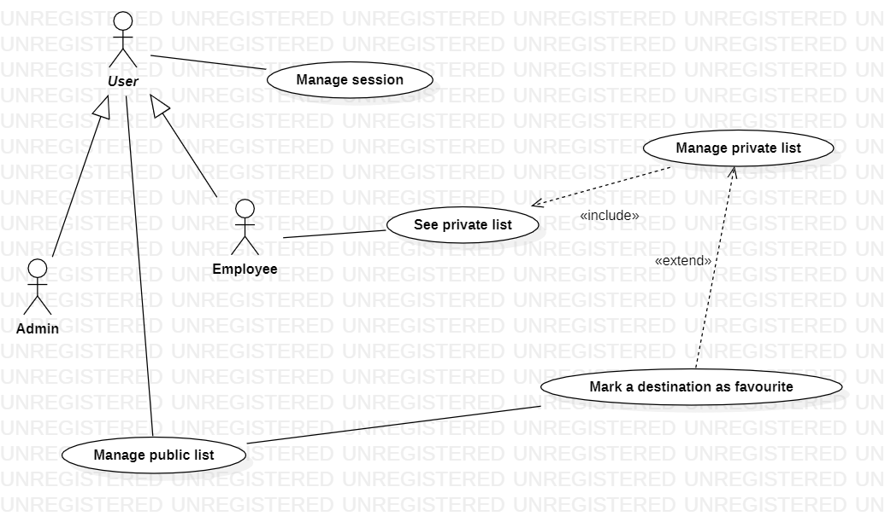

# DestinationBucketListWeb

For this project two technologies were used, namely Angular and Spring, to implement the following features:

Backend Class Diagram:

The backend is deployed on an Google Cloud VM instance, using the following technologies:
-Tomcat is the application server
-Nginx is the reverse proxy
-certbot, used to acquire a certificate for the proxy server, for https connection

The frontend is deployed on Netlify:
https://6482dd64cc1eac375eb9206d--hilarious-lollipop-832f7b.netlify.app/

The frontend is written with Angular using Typescript. Styling was done with Tailwind and CSS. Features route protected pages, login using JWT tokens.

